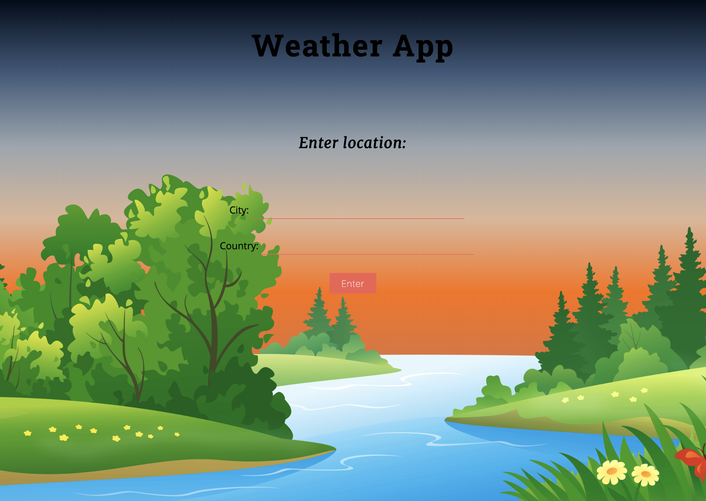

# WeatherApp

* This app makes use of the **OpenWeather REST API** to provide weather to users
* The motive behind creating this app was to learn the **Flask framework**

## Example Hompage:

                                                  
## Example Result Page:

